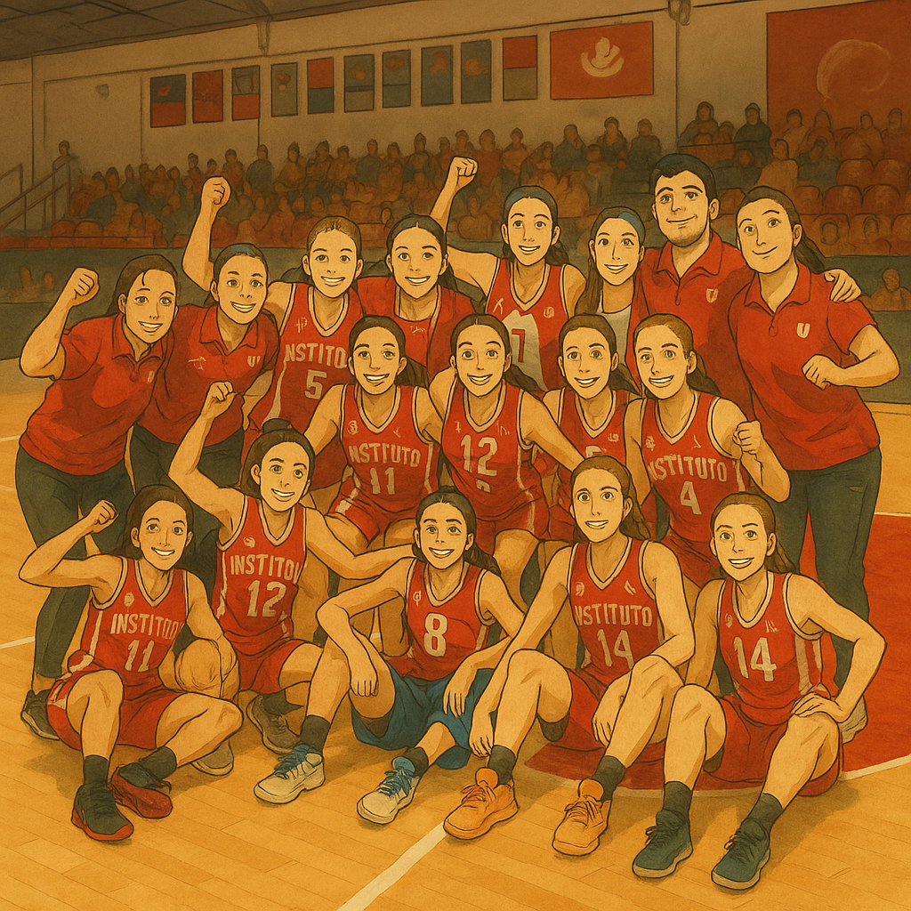

# 🏀 Basketball Stats - Instituto Atlético Central Córdoba (Femenino)  

Bienvenidos a este repositorio donde analizamos el rendimiento del equipo femenino de **Instituto Atlético Central Córdoba**. Aquí exploramos estadísticas clave del equipo y de cada jugadora, además de aplicar el modelo de los **Four Factors**, desarrollado por Dean Oliver, para entender qué impulsa el éxito en el juego.  

## 🏀 **Sobre el Equipo**
El equipo femenino de **Instituto Atlético Central Córdoba** es una de las instituciones más emblemáticas del básquet argentino. Con una rica historia y una fuerte presencia en torneos locales y nacionales, este análisis busca resaltar su desempeño estadístico y aportar información valiosa para mejorar el rendimiento colectivo e individual.  

---

## 📌 **¿Qué puedes encontrar en este repositorio?**
✅ **Análisis de un partido específico.**  
✅ **Evolución de una jugadora a lo largo de varios partidos.**  
✅ **Comparación del equipo con sus rivales en métricas clave.**  
✅ **Visualizaciones interactivas para entender tendencias y fortalezas.**  
✅ **Aplicación del modelo Four Factors para evaluar eficiencia.**  

---

## 📊 **Los Four Factors de Dean Oliver**
El **estadístico y analista de baloncesto Dean Oliver** propuso que el éxito de un equipo depende de cuatro factores fundamentales, que explican casi el **90% de la efectividad de un equipo** en un partido.  

### 🔹 1. **Porcentaje de tiro efectivo (eFG%)**  
📌 *¿Qué mide?*  
Mide la eficiencia de los tiros de campo, considerando que los **triples valen más** que los dobles.  

📖 **Fórmula:**  
\[
eFG\% = \frac{Encestados + 0.5 \times Triples}{Intentos de Tiro}
\]

📊 **Importancia:**  
- Un equipo que lanza con **alta efectividad** maximiza su puntuación sin necesidad de muchas posesiones.  
- Un bajo eFG% indica **problemas en selección de tiro o mala ejecución ofensiva**.  

📖 [Más información aquí](https://www.basketball-reference.com/about/eFG_pct.html)  

---

### 🔹 2. **Pérdidas por posesión (TOV%)**  
📌 *¿Qué mide?*  
Indica cuántas posesiones terminan en **una pérdida de balón en lugar de un tiro**.  

📖 **Fórmula:**  
\[
TOV\% = \frac{Pérdidas}{Pérdidas + Tiros de Campo + Tiros Libres}
\]

📊 **Importancia:**  
- Un equipo con **muchas pérdidas** no aprovecha sus posesiones.  
- **Reducir las pérdidas** mejora la eficiencia sin necesidad de aumentar la precisión en los tiros.  

📖 [Más información aquí](https://www.nbastuffer.com/analytics101/turnover-percentage/)  

---

### 🔹 3. **Rebotes ofensivos (ORB%)**  
📌 *¿Qué mide?*  
Evalúa la capacidad del equipo para **capturar rebotes ofensivos y generar segundas oportunidades**.  

📖 **Fórmula:**  
\[
ORB\% = \frac{Rebotes Ofensivos}{Rebotes Ofensivos + Rebotes Defensivos Rivales}
\]

📊 **Importancia:**  
- Un equipo con **altos rebotes ofensivos** obtiene más oportunidades de anotar.  
- Controlar el rebote ofensivo es **clave contra equipos con buena defensa**.  

📖 [Más información aquí](https://www.basketball-reference.com/about/glossary.html#orb%)  

---

### 🔹 4. **Tiros libres por intento de campo (FT/FGA)**  
📌 *¿Qué mide?*  
Evalúa qué tan bien un equipo **genera y convierte oportunidades desde la línea de libres**.  

📖 **Fórmula:**  
\[
FT/FGA = \frac{Tiros Libres Anotados}{Intentos de Tiro de Campo}
\]

📊 **Importancia:**  
- Los **equipos exitosos suelen ir mucho a la línea de libres**.  
- Si un equipo tiene **un bajo FT/FGA**, puede indicar falta de agresividad en ataque.  

📖 [Más información aquí](https://www.basketball-reference.com/about/glossary.html#ft_fga)  

---

## 📈 **Visualización de datos**
Este análisis se complementa con gráficos interactivos creados con **Python + Pandas + Matplotlib + Seaborn + Plotly**, incluyendo:  
✅ **Comparaciones de Four Factors entre partidos.**  
✅ **Radar charts para evaluar rendimiento individual.**  
✅ **Evolución de métricas clave a lo largo de la temporada.**  
✅ **Gráficos de líneas y barras para tendencias del equipo y jugadoras.**  
